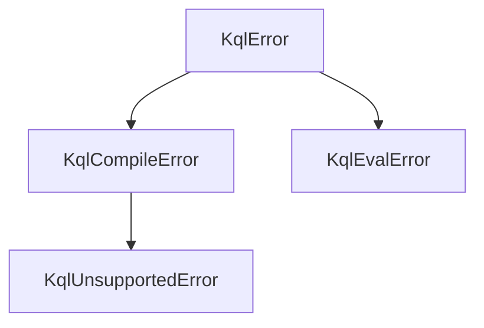

# Usage & API reference

Everything you need lives on the top-level `streaming_kql` package (imported as
`kql` throughout these docs).

```python
import streaming_kql as kql
```

Public surface:

| Symbol | Kind | Purpose |
|---|---|---|
| [`kql.compile`](#kqlcompile) | function | Parse & validate a query into a reusable `Query` |
| [`kql.Query`](#kqlquery) | class | A compiled query; `match` / `transform` / `stream` |
| [`kql.Node`](#kqlnode) | class | Run many standing queries over one feed |
| [`kql.Options`](#kqloptions) | class | Evaluation options (clock, strict typing) |
| [`kql.Schema`](#kqlschema) | class | Optional input column typing |
| [`kql.function`](#custom-functions) | decorator | Register a custom scalar function |
| [Error classes](#errors) | exceptions | `KqlError` and its subclasses |

---

## `kql.compile`

```python
q = kql.compile(source: str, schema: Schema | None = None, options: Options | None = None) -> Query
```

Parses and semantically validates `source` **once** and returns a reusable,
thread-safe [`Query`](#kqlquery). Compile as early as possible and reuse the
result across records.

- **Parse or semantic errors** raise [`KqlCompileError`](#errors) with line/column
  information.
- **Recognized-but-unsupported (stateful) features** raise
  [`KqlUnsupportedError`](#errors) naming the operator.

```python
q = kql.compile("source | where Status == 'active'")

kql.compile("source | summarize count() by X")
# raises KqlUnsupportedError: 'summarize' is a stateful operator
```

> The name `compile` deliberately mirrors `re.compile` ergonomics: compile once,
> evaluate many times.

---

## `kql.Query`

A compiled query. Construct it via `kql.compile` (do not instantiate directly).
It exposes three ways to evaluate a record.

### `Query.transform`

```python
Query.transform(record: Mapping[str, Any]) -> list[dict]
```

The general form. Returns **0..N** output records for one input record. Input
records are never mutated — outputs are new dicts.

```python
q = kql.compile("source | where Price > 80")
q.transform({"Price": 90})   # -> [{'Price': 90}]
q.transform({"Price": 10})   # -> []
```

### `Query.match`

```python
Query.match(record: Mapping[str, Any]) -> dict | None
```

Convenience for **1 → 0/1** queries. Returns the single output record, or `None`
if it was filtered out. Raises `KqlEvalError` if the query produced more than one
record (use `transform` for 1 → N queries).

```python
q = kql.compile("source | extend Full = strcat(First, ' ', Last)")
q.match({"First": "Ada", "Last": "Lovelace"})
# -> {'First': 'Ada', 'Last': 'Lovelace', 'Full': 'Ada Lovelace'}
```

### `Query.stream`

```python
Query.stream(records: Iterable[Mapping[str, Any]]) -> Iterator[dict]
```

Lazily applies the query to a feed, yielding each output record as it is
produced. Memory usage stays flat regardless of feed length.

```python
for out in q.stream(read_events()):
    sink(out)
```

---

## `kql.Node`

A host that runs **many standing queries** over a single feed — the streaming
fan-out pattern (modeled on Rx.KQL's `KqlNode`). Each pushed record is offered to
every registered query.

```python
Node(options: Options | None = None)
Node.add(name: str, source: str, schema: Schema | None = None) -> None
Node.remove(name: str) -> None
Node.push(record: Mapping[str, Any]) -> Iterator[tuple[str, dict]]
```

`push` yields `(query_name, output_record)` pairs so you can tell which query
produced each result.

```python
node = kql.Node()
node.add("high", "source | where Price > 80")
node.add("low",  "source | where Price < 10 | project Symbol, Price")

for query_name, record in node.push({"Symbol": "MSFT", "Price": 90}):
    print(query_name, record)
# high {'Symbol': 'MSFT', 'Price': 90}
```

Options passed to the `Node` constructor apply to every query it hosts.

---

## `kql.Options`

Evaluation options, passed to `kql.compile` (or a `Node`).

```python
Options(now: datetime | None = None, strict_types: bool = False,
        random_seed: int | None = None)
```

| Option | Default | Effect |
|---|---|---|
| `now` | `None` | Fixes the clock used by `now()` and `ago()`. When `None`, the current UTC time is used at evaluation. Set it for deterministic, testable output. |
| `strict_types` | `False` | When `True`, type/value errors raise [`KqlEvalError`](#errors). When `False` (default), such situations yield `null` — KQL's null-tolerant behavior. |
| `random_seed` | `None` | Seeds the RNG used by `sample`/`sample-distinct`. Set it for deterministic, reproducible sampling. |

```python
from datetime import datetime, timezone

opts = kql.Options(now=datetime(2026, 1, 1, tzinfo=timezone.utc))
q = kql.compile("source | extend AgeDays = datetime_diff('day', now(), Created)", options=opts)
```

> Additional options (`regex_engine`, `time_zone`) are described in the spec as
> planned but are not yet implemented.

---

## `kql.Schema`

Optional declaration of input column KQL types. When supplied, each declared
column of an input record is **coerced** to its KQL type before the query runs.

```python
Schema(columns: dict[str, str] | None = None)
```

```python
schema = kql.Schema({"TimeGenerated": "datetime", "AdditionalContext": "dynamic"})
q = kql.compile("source | extend Level = toint(AdditionalContext.Level)", schema=schema)

q.match({"TimeGenerated": "2021-11-07T09:13:06Z",
         "AdditionalContext": '{"Level": 2}'})["AdditionalContext"]
# -> {'Level': 2}   (the JSON string was coerced to a dynamic object)
```

Coercion is null-tolerant: a value that can't be converted becomes `null`, and
undeclared columns pass through unchanged. See
[Type coercion](supported-kql.md#type-coercion) for the full type table.

---

## Custom functions

Register a Python callable as a scalar function usable inside any query
expression. Registration is global and applies to queries compiled afterward.

```python
@kql.function("domain_of")
def domain_of(email: str) -> str:
    return email.split("@", 1)[-1]

q = kql.compile("source | extend d = domain_of(From)")
q.match({"From": "ada@example.com"})
# -> {'From': 'ada@example.com', 'd': 'example.com'}
```

Guidelines:

- The name is case-insensitive (KQL identifiers fold to lower case for lookup).
- Arguments arrive as already-evaluated Python values; return a Python value.
- In the default null-tolerant mode, prefer returning `None` over raising for
  bad input, to match KQL semantics. Under `strict_types=True`, a raised
  exception surfaces as [`KqlEvalError`](#errors).
- A custom function with the same name as a built-in overrides it for
  subsequently compiled queries.

---

## Errors

All exceptions derive from `KqlError`.



| Exception | When | Notes |
|---|---|---|
| `KqlError` | base class | Catch this to handle any library error. |
| `KqlCompileError` | at `compile` time | Lex/parse/semantic failure. Carries `.line` and `.col`. |
| `KqlUnsupportedError` | at `compile` time | A recognized but unsupported (stateful) feature — subclass of `KqlCompileError`. The message names the operator. |
| `KqlEvalError` | at evaluation time | Only raised when `Options.strict_types=True`; otherwise such cases yield `null`. |

```python
try:
    q = kql.compile("source | sort by Time")
except kql.KqlUnsupportedError as e:
    print(e)   # 'sort' is a stateful operator ... (line 1)
```

---

## Threading & reuse

A compiled `Query` is immutable and **thread-safe** for evaluation — compile once
and share it across threads and records. The performance cost is paid at
`compile`; `match`/`transform`/`stream` are lightweight per-record calls.
